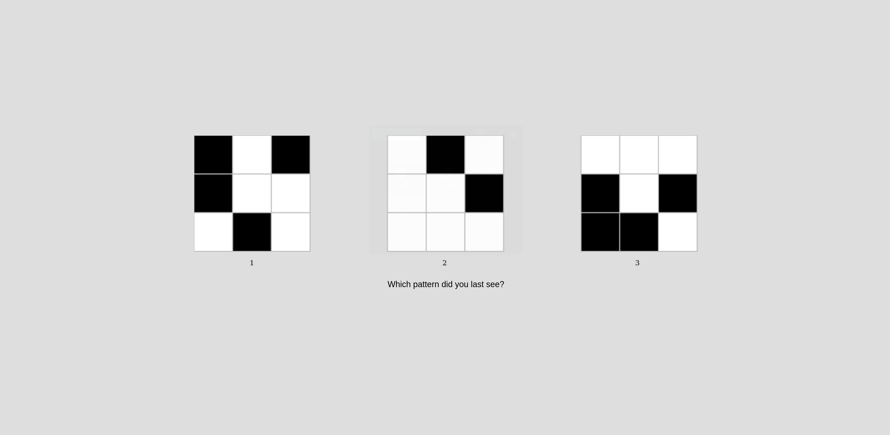

## Match-to-sample

Delayed match-to-sample experiment designed on JavaScript

The experiment utilizes checkerboard stimuli at resolutions 1x1, 2x2, 3x3, and 4x4 for EEG signal collction. All have been designed on JavaScript using the jsPsych library (https://www.jspsych.org/). 

#### Experimental procedure

Participants are shown a stimulus for 2s, followed by another 2s to identify it among several options. The experiment consists of four rounds, one for each resolution, separated by 1-minute breaks. Example screenshots of the match-to-sample task are shown below. 

<b>3x3</b>:

#### References
https://www.jspsych.org/overview/timeline/ (jsPsych documentation)
https://github.com/fredvbrug/STOP-IT/tree/master/jsPsych_version
